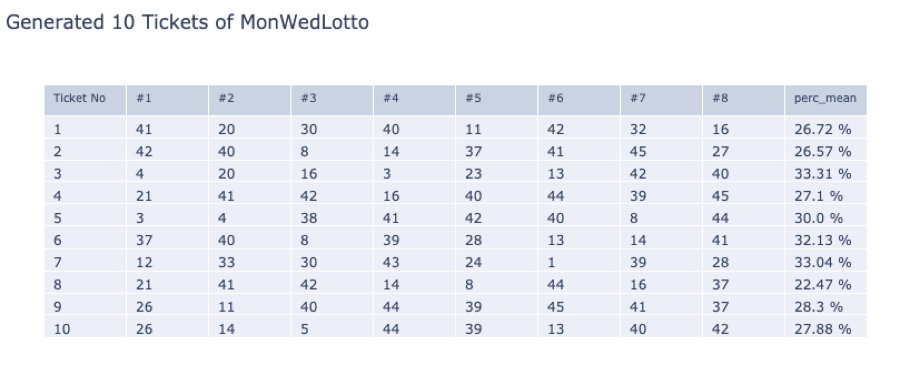

### Simple Statistical Analysis of Australian Lottery

### Idea:

<p align="center">

</p>
<p align="center">
Previous Draws of MonWedLotto per number <br>
Image Source: https://www.thelott.com/mon-wed-lotto/results
</p>

* Statistically, each number has the same chances for being drawn (independently). Hence the repetitions per number are roughly the same in the long term perspective.

* The image shown above shows that the "draws" of numbers are almost-equally distributed.
  * It seems like it implies that the lottery machine abides by the rule "true randomness."

* If the lottery machine plays by the "true randomness" rule, with a number drawn, the chances of the other number gets picked are identically equal to each other. (1 / remainders in the machine).

### Objective:
* The main objective of this side-project is conducting a simple statistical analysis to visually check whether the lottery machine follows the rule based on the previous draws since 2012 January.
* Conducted against two lotteries: Mon & Wed Lotto and Saturday Lotto. It is only because those are the two lotteries I buy weekly.
* The minor objective is making a ticket generator based on the conducted analysis to have a "higher-chance-of-winning" for ___fun___.


### Result:
#### Analysis:

<p align="center">
 <br>
Top 4 numbers that are drawn the most with number ___28___
</p>

* The number ___13___ were drawn __43__ times, which is __70%__ more than the average; 25 times.
* Most of the numbers tend to have __around 20-30%__ more chances to be drawn together with its top four numbers than the averages.

```python
# Adjust n to create data with top_n numbers per each number
retrieve_plot_info(corrNums_data, n)
```

#### Ticket Generator:

* ___Again, this is for fun and the used odds are BASED ON the previous draws.___
* If you want to make complete-random tickets, do so at https://www.random.org/quick-pick/

```python
# Ignore 0.5 - threshold for future implemenation
# 5 - top_n elements you want to generate from the data.
ticket_generator(df_wed_corrNums, 0.5, 5)

# By setting None -> Random First number pick
# Otherwise, put number in it
gameGenerator(df_wed_corrNums, 10, 5, None)
```

* By running the above functions, you will be able to have the following generated tickets:

<p align="center">
 <br>
Generated Tickets based on the above conducted analysis
</p>

* ___perc_mean___ is the average percentage that shows how much more likely the ticket to be drawn together compares to the other numbers (in average) as a set.
* For example, in Ticket No. 1:
    * 20 (#2) has 25% (roughly) chances of more likely being drawn together with 41 (#1)
    * #3 has a% chances of .... with 20 (#2)
    * and so on...
* In another interpretation, it could be said that those numbers (in each generated ticket) are ___perc_mean___ more bound to each other.
